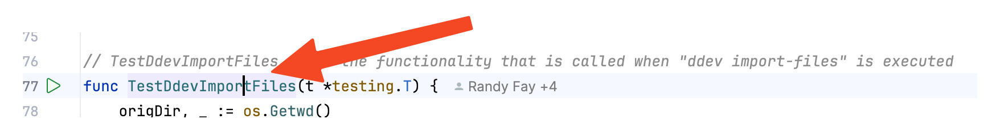
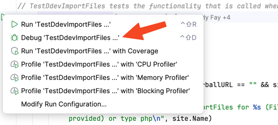

Here's our September 18, 2024 [Contributor Training](/blog/category/training) on maintaining DDEV automated tests:

<div class="video-container">
<iframe width="560" height="315" src="https://www.youtube.com/embed/TGNDBzNsF6I?si=My_NAUVP5HXR6ikQ" title="YouTube video player" frameborder="0" allow="accelerometer; autoplay; clipboard-write; encrypted-media; gyroscope; picture-in-picture; web-share" referrerpolicy="strict-origin-when-cross-origin" allowfullscreen></iframe>
</div>

## DDEV's Automated Tests

DDEV has three main types of tests:

- Go “pkg” tests, that don’t use an external `ddev` binary. These are mostly a "pure" form of Go test. There are both end-to-end tests and some unit tests.
- Go “cmd” tests that rely on a matching external `ddev` binary. These are almost scripted tests, written in Go, but calling out to execute the `ddev` binary and exercise it.
- Container tests written using bats (bash).

Golang tests are in files named `*_test.go` and the tests themselves are functions named `Test*`. For example the test [TestConfigFunctionality](https://github.com/ddev/ddev/blob/507cfca2508b97786b80e8b8c83ea17f5c0fea20/pkg/ddevapp/config_test.go#L1458) is in the file [config_test.go](https://github.com/ddev/ddev/blob/main/pkg/ddevapp/config_test.go).

## How many tests are there? How many lines of test code?

According to cloc there are currently 22,322 lines of go code: (`cloc ./pkg ./cmd --include-lang=Go --not-match-f='.*_test\.go$'`) and 14,853 lines of go test code (`*_test.go`): (`cloc ./pkg ./cmd --include-lang=Go --match-f='.*_test\.go$'`)

## What should a contributor work on?

### Debugging broken tests

Broken tests, of course, can be a result of broken code or broken tests. These often come up in the process of building a PR, and they need to be fixed, usually in the code, but sometimes it's the test that's at fault.

In all cases, the first thing to do is to try to execute the test manually and locally, or perhaps just try to execute what the test was trying to do. For example, if the test fails doing an `app.Start()`, just try stepping through `app.Start()` in `ddev start`.

Demonstrations of stepping through a test in the debugger are below.

### Flaky tests

Flaky tests are the worst, because they may depend on the execution environment, or some other test may have polluted the environment, or they may happen in particular network situations.

- Review the test output from Buildkite or GitHub workflow to try to understand what's actually going on. There may be an earlier error that's reported that causes the actual failure.
- Try to run it manually, perhaps step-debugging and introducing slower execution.
- Try to run it on GitHub Codespaces, which is a more similar environment.
- Try to run it using [tmate](https://github.com/mxschmitt/action-tmate) on the GitHub workflow, which is as close as you can get to the real test environment. (Tmate is built into each of the DDEV test workflows.)

### Fragile or brittle tests

Fragile and brittle tests may be a result of specific expectations in the code, for example, looking for a particular string instead of a more general expectation. Sometimes these can be understood by looking through the test run. Often the test needs to be restructured, or the expectation can be turned into a regular expression instead of a specific literal expectation.

### Slow tests

The easiest place to look at slow tests is a full buildkite test run, which shows the timing for each test. In some cases, the timing is essential, for example, where we test every single database type and version and capability in [TestDdevAllDatabases](https://github.com/ddev/ddev/blob/507cfca2508b97786b80e8b8c83ea17f5c0fea20/pkg/ddevapp/ddevapp_test.go#L1652-L1893). But in many cases, we do too much and it doesn't all have to be done. We can _skip_ the test in some environments (this one gets skipped on Lima and Colima). And we can do a limited selection of the most important test targets (this one does only `postgres:14`, `mariadb:10.11`, `mariadb:10.6`, `mariadb:10.4`, `mysql:8.0`, `mysql:5.7` when `GOTEST_SHORT=true`).

- Does the test need to be run on this target system?
- Do all the permutations need to be done?
- Does DDEV need to be stopped and started over and over again?
- Are we waiting too long for something, wasting time?

## Possible infrastructure test improvements

- Could we run most PR tests only on Linux and macOS ARM64, and then cover other platforms on the default branch? Sometimes errors sneak in that way and the default branch tests have to be watched closely, but most of the time if it works on macOS and Linux it's "good enough".
- It's possibly time to completely drop macOS AMD64 testing.
- Is it time to add Windows/WSL2 ARM64 testing?
- The carbon costs of all this testing are non-trivial and should be considered.
- Could we run at least tests in parallel? What would be the implications? In current HEAD DDEV knows how to open new ports if the default ports are occupied. However, sharing a single `ddev-router` would still be problematic.
- The output of our tests is really hard to read.

## Running and debugging tests individually

- [Setting up a Go Development Environment](setting-up-a-go-development-environment.md) has more hints about overall setup. Mostly there's nothing to do but run Goland and make sure that the Settings->Go->GOROOT is set correctly. `go env GOROOT` will show the correct directory.
- To save time, make sure to define the environment variable `GOTEST_SHORT=true`, or set it to a useful value for TestDdevFullSiteSetup. These values are in the [TestSites array](https://github.com/ddev/ddev/blob/507cfca2508b97786b80e8b8c83ea17f5c0fea20/pkg/ddevapp/ddevapp_test.go#L42-L365). For example, `GOTEST_SHORT=12` is for Drupal 10. If you don't set this, the test runner will spend lots of time downloading test tarballs that you don't need to wait for.
- If you're running one of the “cmd” tests (mostly named something like `TestCmd*`, and all located in the `cmd` directory) then make sure that the related `ddev` binary from the same code is first in your `$PATH` so that you don't get confused about the behavior. Remember that those tests actually execute the `ddev` binary externally, rather than doing critical actions themselves.

### Running on the command line

You can run a specific test with invocations like this:

```bash
make testpkg TESTARGS="-count=1 -run TestDdevImportFiles"
make testcmd TESTARGS="-count=1 -run TestCustomCommands"
make test TESTARGS="-count=1 -run TestDdevImportFiles"
```

The `testpkg` and `testcmd` `make` targets are just shortcuts telling it not to look everywhere, but you can use `make test` and let it look everywhere if you're willing to wait.

`-count=1` means not to cache test results, which can be very confusing.

The tests to run (`-run TestDdevImportFiles`) is a regular expression, so you can run multiple tests with `make testpkg TESTARGS="-run TestDdevImport"` or `make testpkg TESTARGS='-run "Test.*Import"'` or `make testpkg TESTARGS='-run "Test.*Import(DB|Files)"'`

### Running in GoLand

My basic approach in GoLand is to run the test first, then to step-debug through it. So I visit the function, maybe [TestDdevImportFiles](https://github.com/ddev/ddev/blob/e5006cd8ccac9df2f4f4c3ad51c12cc06641ce67/pkg/ddevapp/ddevapp_test.go#L2606) and click the arrowhead next to it:



If it passes or fails, I'll likely click on a line to create a breakpoint and then step-debug through it by clicking on the arrowhead icon and select to debug it:



### Running in Visual Studio Code (VS Code)

**Exercises**:

- Run tests manually both on GoLand and VS Code.
- Find a heavy test and discuss how it can be improved. For example, look at [buildkite test](https://buildkite.com/ddev/ddev-macos-amd64-mutagen/builds/5288#018ace86-3250-4f5b-a5d7-5bb9b09cd9df) or [buildkite docker-ce](https://buildkite.com/ddev/wsl2-docker-inside/builds/2443#018acec4-6d27-44fe-8573-2e0a5080dc21).
- Look at a flaky test, [TestGetLocalHTTPResponse](https://buildkite.com/ddev/wsl2-docker-desktop/builds/5077#018acfa3-f71f-4b7b-bb92-16c4b9a88de1) (not so flaky any more, but first “real” test in the series.)

## Resources

- [Training: Setting up a go development environment](setting-up-a-go-development-environment.md)
- [DDEV docs: Building, Testing, and Contributing](https://ddev.readthedocs.io/en/stable/developers/building-contributing/)
- The GitHub Workflow tests and Buildkite tests are shown on every PR run and every run on the default branch. If you don't have access to see them, just ask in [Discord](/s/discord) or the [issue queue](https://github.com/ddev/ddev/issues), and you can get it.

## Contributions welcome!

Your suggestions to improve this blog are welcome. You can do a PR to this blog adding your techniques. Info and a training session on how to do a PR to anything in ddev.com is at [DDEV Website For Contributors](ddev-website-for-contributors.md).

Join us for the next [DDEV Live Contributor Training](/blog/contributor-training/). Sign up at [DDEV Live Events Meetup](https://www.meetup.com/ddev-events/events/).
